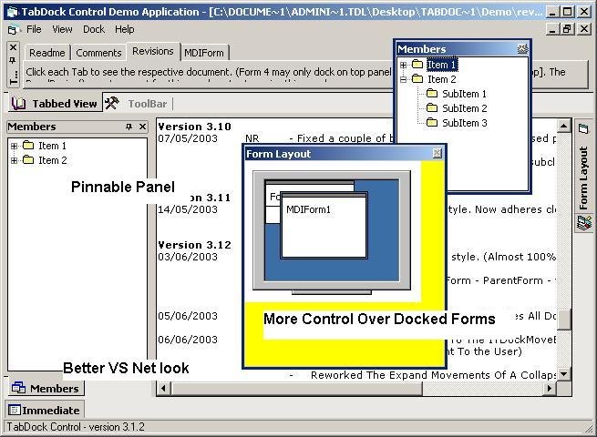



## TabDock 3\.13

### Description

Tabdock 3.1.3

Bugfix release (see revisions.rtf for full details)

Two Major Improvements.

1) Extensively Updated. VS.Net Caption Style Now Adheres Closely To New Microsoft Applications.

With Pinnable Panels And Tabs.

2) The Control Now Has The Option To Use The New ITDockMoveEvents Interface.(Have More Control Over Docked Panels).

Panel Painting Is Now Much Better And Smoother.

Too Many Updates To Mention. Please Look At The Revision RTF To Get The Full History Of The Control.

On A Personal Note

I Would Like To Thank Neal Who Has Put A Lot Of Effort Into This Control.

Your Comments And Suggestions Are Greatly Appreciated.

Enjoy The Code!

Gary.
 
### More Info
 

             |
---                |---
**Submitted On**   |2003-06-13 10:21:20
**By**             |[NR/GN](https://github.com/Planet-Source-Code/PSCIndex/blob/master/ByAuthor/nr-gn.md)
**Level**          |Advanced
**User Rating**    |4.9 (219 globes from 45 users)
**Compatibility**  |VB 6\.0
**Category**       |[Custom Controls/ Forms/  Menus](https://github.com/Planet-Source-Code/PSCIndex/blob/master/ByCategory/custom-controls-forms-menus__1-4.md)
**World**          |[Visual Basic](https://github.com/Planet-Source-Code/PSCIndex/blob/master/ByWorld/visual-basic.md)
**Archive File**   |[TabDock\_3\_1605646252003\.zip](https://github.com/Planet-Source-Code/nr-gn-tabdock-3-13__1-46061/archive/master.zip)

